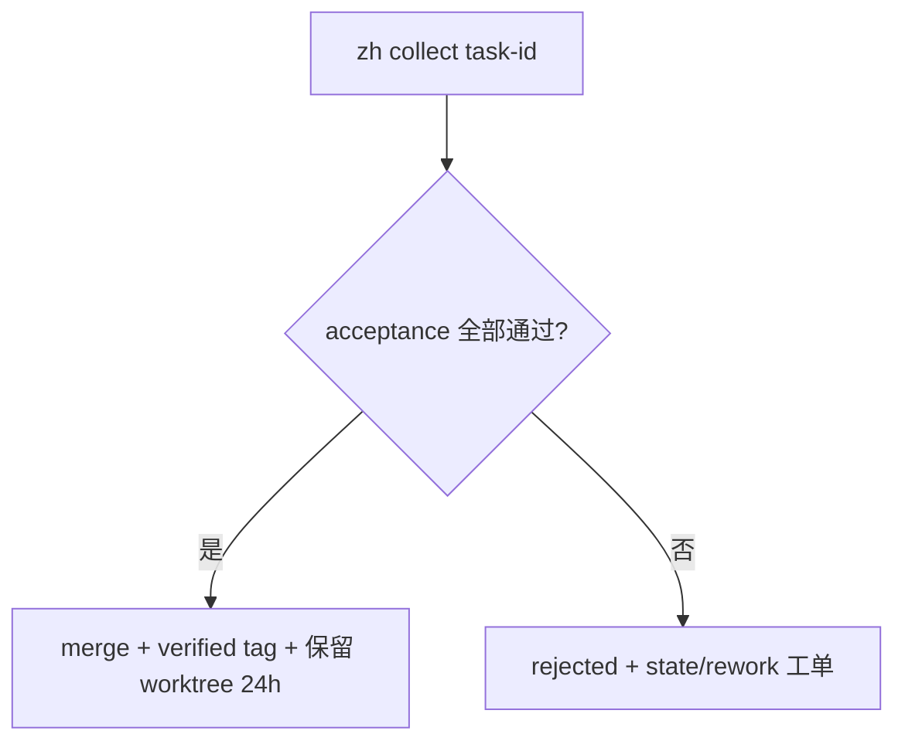

# 智汇 zhihui

编码代理统一调度台：多家 AI 编码工具（Codex/Qoder/…）按额度×难度×能力路由派活，git worktree 隔离执行，统一验收收口。

- 需求：specs/2026-09-21-zhihui/spec.md（v2.0 定稿中）
- 方案：specs/2026-09-21-zhihui/plan.md
- 评审：specs/2026-09-21-zhihui/codex-implementation-v3.md


## 60 秒派发（T2）

先在 `fleet.json` 设置 `workspaces_root` 与可选的 `max_worktrees`，再写一个任务书：

```json
{"task_id":"hello-1","repo_path":".","base_ref":"main","brief":"给 README 加一行"}
```

```sh
zh dispatch task.json --to local-agent --fleet fleet.json --data state
zh tasks --data state
```

headless driver 的 `launch` 可使用 `{brief}`、`{worktree}`、`{log}` 占位符。先用 `--dry` 预览命令；manual driver 不启动进程，显示“任务书已登记待粘贴”，随后用 `zh attach hello-1 --branch agent/hello-1` 登记外部产物。

## Collect 验收收口（T3）



验收命令只来自任务 JSON 的 `acceptance.checks`，并以数组参数直接运行；任务 brief 和日志不会被执行。

```sh
zh collect hello-1 --data state
zh history hello-1 --data state
zh prune --data state       # 仅清理已过 24 小时保留期的 verified worktree
```

## Route 与 usage（T4）

```sh
zh route task.json --fleet fleet.json --data state --explain
zh usage --week 2 --fleet fleet.json --data state
```

| 因素 | 默认规则 |
| --- | --- |
| 硬门槛 | 能力不全、offline/FAIL、free-tier 水位 `<0.20` 直接排除 |
| 成本 | free-tier `1.00`，manual `0.95`，paid-fixed `0.90` |
| 成功率 | 近 5 次成功率，最小 `0.50`；样本少于 3 次按 `1.00` |
| 难度 | 难度 ≥8 的 high 模型 `+0.20`；难度 ≤3 的 low 模型 `+0.10` |

路由只输出建议。即使使用 `--to`，能力、健康和额度硬门槛仍不能绕过；`usage` 对付费固定套餐只展示已配置的限速事实，不会显示“无限”。
