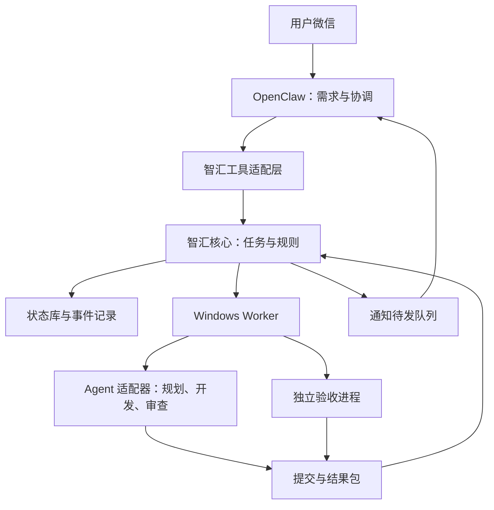

# 智汇：OpenClaw 编码编排详细实施方案与模型路由指南

> 版本：v3.0 详细实施讨论稿  
> 整理日期：2026-09-21  
> 适用环境：微信入口 + 树莓派 OpenClaw + Windows 11 执行机  
> 状态：架构建议，待确认后转为实施任务；不是已部署能力说明。

## 阅读说明

本文保留 v2 的完整架构基础，并新增第 21—32 节：具体模型推荐、任务路由、轻重工作流、协议与事务、Worker 工程要求、上传接口和实施任务书。先读第 1—5 节理解整体；开发细节见第 6—14、24—27 节；模型选择见第 22—23 节；另一 AI 的接收接口见第 30 节；实施顺序见第 16、31 节。

原始依据为上传压缩包中的 `spec.md`、`plan.md`、`task-T1.md`，以及本次关于 OpenClaw 的补充需求。本稿不自动覆盖原文件，也不表示已获得修改仓库、安装插件、配置账号或部署服务的授权。

本文中的命令、工具名、数据结构、路径均为拟议约定或示例，不是已经存在的产品接口。具体实现必须先核验当前 OpenClaw 版本、微信接入和真实 CLI 能力。

## 1. 结论：做一个可靠的开发任务系统，不做第二个 OpenClaw

智汇值得做，但要围绕已有的 OpenClaw 工作方式建设。

- OpenClaw：理解微信需求、组织讨论、协调规划、向用户汇报。
- 编码 Agent：阅读仓库、提出技术方案、开发或审查代码。
- 智汇：保存任务、执行授权规则、排队、派发、收集证据、控制返工和恢复。
- 用户：决定产品目标、授权范围、重要取舍，以及是否合并和上线。

核心原则：模型负责判断，程序负责记录与约束，证据决定是否通过。

首要价值不是自动挑最便宜的 AI，而是让工作不会丢、不会重复执行、不会假报完成。免费额度利用应放在可靠闭环之后。

### 1.1 已有背景与待核实项

| 类别 | 内容 |
| --- | --- |
| 用户已说明 | 已长期使用 OpenClaw，习惯通过微信下任务；当前模型称为“千问 3.8 Flash” |
| 已有部署背景 | 树莓派运行 OpenClaw；Windows 11 作为较强的执行机，已有 Git 和 VS Code |
| 原方案记载 | 使用已有 SSH 基础设施连接 Windows，原文曾列出台式机局域网 IP |
| 本轮尚未实测 | OpenClaw 版本、具体模型 ID、微信插件类型、SSH 连通性、Windows 可用编码 CLI、登录状态 |
| 本文处理方式 | 保留现有入口和模型，不猜测配置项，不假定任何 CLI 已能无人值守运行 |

不能仅凭模型名称断定其规划能力。以真实小任务验证工具调用、结构化输出、上下文理解和遗漏率，再决定哪些工作交给主会话。

## 2. 总体架构与部署边界

### 2.1 三个运行部分

| 部分 | 建议位置 | 具体职责 | 不承担的职责 |
| --- | --- | --- | --- |
| OpenClaw 接入层 | 树莓派现有 OpenClaw | 微信接收、需求整理、规划请求、解释结果 | 不靠聊天记忆维护执行状态，不直接裁定测试通过 |
| 智汇核心 | 树莓派，单个常驻进程 | 任务库、队列、授权、依赖、路由、事件、恢复、通知待发队列 | 不实现聊天平台，不转发裸模型请求 |
| Windows Worker | Windows，后台服务 | 工作区、Agent 进程、日志、测试、结果包、取消确认 | 不决定产品范围，不修改全局授权策略 |

`zh` CLI 和 OpenClaw 工具适配层都调用同一套核心逻辑，不能分别维护两套状态。



图中回报仍通过原 OpenClaw 微信通道完成，智汇不再维护微信账号或聊天联系人。

### 2.2 复用 OpenClaw，而不是重复建设

当前官方文档提供 Skill、外部编码代理 ACP 接入以及节点执行等能力，见文末参考资料。应先检查已安装版本能提供哪些能力，再选择接入方式。

建议第一版采用已熟悉的 SSH 连接 Worker；若原生节点或现有代理接入已经验证可用，可以作为传输或 Agent 适配器复用，但不应为采用某项新能力强行升级现有稳定环境。

同一个执行尝试只能有一个进程生命周期控制者。若采用 OpenClaw 的代理会话，就记录和管理该会话；若采用 Worker 启动 CLI，就由 Worker 管理。不能让两个系统各自重试同一份任务。

### 2.3 与原“平台不定义开发流程”的边界

本稿中的规划、开发、审查是推荐的调用方工作流。智汇核心只理解阶段、依赖、证据、预算和授权，不把麻将规则或固定开发 SOP 写进代码。

业务流程放在版本化的工作流配置和 OpenClaw 指令中，项目验收放在项目配置中。这样未来也能支持文档修改、依赖升级等其他任务。

## 3. 角色分工：谁负责大纲，谁负责代码

角色不等于模型，不等于主机，也不等于需要常驻的新 Agent。

| 角色 | 接收内容 | 输出内容 | 建议执行方式 |
| --- | --- | --- | --- |
| 协调者 | 微信需求、项目摘要、任务状态 | 需求卡、澄清问题、用户摘要 | 现有 OpenClaw 主会话 |
| 规划者 | 需求卡、指定仓库基线 | 勘察证据、技术方案、子任务依赖、验收计划 | 能读取仓库的编码 Agent，限制修改权限 |
| 开发者 | 单个完整任务包 | 工作分支、代码、变更说明、待解决问题 | 已验证的编码工具 |
| 审查者 | 冻结的候选提交、需求、差异与证据 | 带位置和依据的问题清单 | 独立只读会话，按风险启用 |
| 验收器 | 候选提交、已批准的验收配置 | 实际命令、退出码、测试报告 | Worker 启动的确定性程序 |

千问主会话负责把技术方案说明白，不应在没有代码证据时凭空定文件名或判断根因。规划者能力不足、方案反复矛盾时，可以在已批准预算内升级给更合适的规划工具。

审查与开发可以使用同一产品的不同会话，但独立会话不代表完全独立的判断。高风险变更可以再增加不同工具审查或人工检查，不必为每次 README 修改都支付双份成本。

## 4. 从微信到交付：完整流程

### 4.1 接收与去重

接入层记录消息来源、发送者、会话和消息 ID；同一条消息重复投递时返回原任务，不创建新任务。

如果微信插件没有稳定消息 ID，应明确记录能力限制，并采取短时间窗口的保守重复检测；不能宣称能完美区分两次相同的独立指令。

项目有歧义时才询问用户；已经明确绑定项目的会话不反复询问仓库。

### 4.2 整理需求卡

需求卡固定包含：原话、目标、必须满足的条件、不在范围、已知信息、待核实信息、授权范围。

例如“麻将缺人也能开始，机器人不能看别人牌”应整理为业务约束，不应直接猜测某个代码文件需要修改。

### 4.3 勘察仓库与基线

先确定仓库和基准提交，再检查目录、相关模块、已有测试、构建配置、工作区脏状态和项目内指令。

脚本负责收集事实，编码 Agent 负责推理；根因结论要标注证据，区分“已复现”“疑似”“待验证”。

优先在独立快照或工作区做勘察。不覆盖用户本地未提交内容，不擅自暂存、清理或重置用户分支。

只读规划是代码修改权限限制，不等于运行任何脚本都安全。安装依赖、启动项目和执行测试可能产生副作用，应在受限环境中按项目策略执行。

### 4.4 生成计划与验收方式

规划者输出目标对应关系、模块变更、任务依赖、可测判据、人工检查项、风险和待决策事项。智汇校验结构完整性，不凭程序校验替代技术正确性审查。

缺少验收方式、依赖成环、范围明显超出需求、预算缺失时，计划不能直接进入执行队列。

### 4.5 检查授权，而不是一律重复问“开始吗”

- “分析一下”：仅分析，不进入开发。
- “修好并测试”：在现有授权和项目规则允许范围内推进。
- “按这个方案做完”：授权绑定计划版本、范围、预算。
- 扩大范围、新增付费、改生产数据、合并或部署：按预设规则另行确认。

微信回复“开始”如果对应多个待确认任务，应要求选择任务，不能猜。授权记录由接入层和核心根据真实消息与身份形成，不能接受模型自填 `approved=true`。

### 4.6 排队与派发

智汇检查依赖通过、资源空闲、工具可用和预算余量，生成执行尝试。Worker 持久保存接单记录后才返回接收成功。

Worker 准备分支和工作区，投递任务包，再启动相应 Agent。用户立即收到任务 ID，不占用微信会话等待全过程。

### 4.7 验收、返工、交付

Agent 结束后，Worker 固定候选提交，在独立验证工作区执行已批准的验收计划。必要时增加只读审查。

代码失败可在预算内返工；环境、授权、需求不明等问题分别处理。最终交付包含代码版本与证据，不把待合并、待人工验收或待部署说成已上线。

## 5. 大纲如何拆成任务图

拆分依据是“可单独验收的结果”，不是平均分配模型工作量。

以麻将机器人需求为例，下表仅示范方法，实际以仓库勘察为准。

| 子任务 | 内容 | 前置任务 | 核心验收 |
| --- | --- | --- | --- |
| T1 | 定义机器人可见信息和动作接口 | 无 | 不向机器人输入其他玩家暗牌；动作可被规则引擎校验 |
| T2 | 开局补位和回合流程接入 | T1 | 1、2、3 名真人均可开始并继续对局 |
| T3 | 实现机器人决策 | T1 | 只使用允许信息，输出合法动作，满足响应时限 |
| T4 | 联调与回归 | T2、T3 | 完成完整对局；断线、超时等路径不使房间永久卡死 |

“机器人中等偏强”需要额外定义对战基线、样本量和评价指标，不能用动作合法率代替强度验收。

拆分规则：

1. 每个子任务有明确输入、输出、依赖和完成判据。
2. 一个任务不混入多个无关目标；小改动也不为了流程拆成十个碎任务。
3. 共享接口先固定；无法独立验收的紧耦合修改优先放同一任务。
4. 第一版同一项目串行写代码，接口和路径不冲突时才考虑并行。
5. 计划变更产生新版本。新增范围先走授权，不能悄悄改变原计划。
6. 暂未实现的需求必须列出，不从计划中无声消失。

建议增加“需求—任务—验收”对应表：每个必须条件至少关联一个任务和一条验证证据，用于检查遗漏。

## 6. 核心数据与任务包

### 6.1 需要区分的对象

| 对象 | 作用 |
| --- | --- |
| Project | 已登记的目标仓库、执行主机、验收规则、权限策略 |
| Plan | 一次需求的方案及版本，包含任务依赖 |
| Task | 一项业务工作，重试时身份不变 |
| Attempt | 一次具体执行，换工具或重试时新建 |
| Session | 外部编码工具内部会话，允许为空或不可恢复 |
| Artifact | 提交、报告、日志、截图等证据 |
| Approval | 谁对哪个计划版本和动作授予了什么权限 |
| Event | 状态变化与执行事实，带事件标识和顺序 |

`task_id`、`attempt_id`、`session_id`、`commit_sha` 不能混为一谈。

### 6.2 每次派发必须携带的任务包

- 原始需求、已确认决策、计划版本。
- 项目 ID、任务 ID、执行尝试 ID、基准提交。
- 目标、不做什么、前置任务的已验收成果。
- 允许改动范围、敏感文件与受限动作。
- 文件索引与相关文档；接手 Agent 仍可读取许可范围内的仓库。
- 验收配置 ID 与版本、业务判据、人工验收项。
- 时间上限、返工次数、允许工具及费用限制。
- 如果返工，附失败命令、日志、预期行为与上次变更。

任务包不包含完整微信历史、账号密钥或无关个人信息。长日志以摘要加引用方式交接，必要时按权限查看原文。

### 6.3 拟议任务结构示例

以下 JSON 是字段示例，不可直接当成已存在接口调用；提交 SHA 等占位值在真实系统中必须替换为有效值。

```json
{
  "schema_version": 1,
  "task_id": "T-001",
  "project_id": "mahjong",
  "plan_id": "P-001",
  "plan_revision": 2,
  "role": "implement",
  "goal": "支持人数不足时补齐机器人并开始对局",
  "base_sha": "<resolved-commit-sha>",
  "depends_on": ["T-000"],
  "allowed_paths": ["server/", "test/"],
  "acceptance_profile": "mahjong-default@1",
  "manual_checks": ["手机端体验确认"],
  "limits": {
    "execution_timeout_minutes": 40,
    "max_repair_attempts": 2,
    "allow_extra_paid_usage": false
  },
  "approval_ref": "AP-001"
}
```

路径范围是策略输入，不能仅靠字符串前缀判断安全。执行器还需校验真实路径、路径穿越、符号链接及工作根目录边界。

## 7. 接口与调用约定

### 7.1 OpenClaw 面向智汇的工具

建议只暴露结构化动作，而不是通用 shell。

| 拟议动作 | 输入要点 | 返回要点 |
| --- | --- | --- |
| `project_list` | 已认证调用者上下文 | 可访问项目摘要 |
| `request_create` | 项目、原始需求、幂等标识 | 需求/任务 ID |
| `plan_request` | 需求 ID、勘察范围 | 规划任务 ID |
| `plan_get` | 计划 ID | 版本、任务、风险、待决策项 |
| `plan_execute` | 计划 ID、版本、授权引用 | 排队结果或明确拒绝原因 |
| `task_get` | 任务 ID | 阶段、最新证据、阻塞原因 |
| `task_cancel` | 任务 ID、预期版本 | 取消请求状态，非虚假“已停止” |
| `result_get` | 任务或计划 ID | 提交、测试、人工待验项 |

这些动作可以由 OpenClaw 工具插件调用本地核心，也可以由受控 CLI 包装提供。Skill 仅说明何时调用，权限检查在实际接口实现中。

要求：写动作有幂等键；变更操作检查版本；返回稳定错误码；不把完整大日志塞入每次工具返回；模型不能伪造发送者、审批人或通知目的地。

### 7.2 核心与 Worker 的协议

第一版只需 `probe / submit / status / cancel / collect` 五类动作。

- `submit`：携带 attempt ID、任务包摘要、固定基线与执行策略；同一 ID 重复提交返回同一执行，不重复启动。
- `status`：返回执行阶段、进程状态、心跳和最后事件序号。
- `cancel`：请求停止，Worker 确认进程树退出后才报告终止。
- `collect`：按清单获取结果与校验摘要，重复调用不产生重复成果。
- `probe`：分别报告主机、工具、登录和运行能力，不用“SSH 通了”代替全部可用。

SSH 只调用固定 Worker 入口，通过结构化输入传参；不把用户原文、仓库名或文件内容插入任意 shell 模板。传输与启动命令需要做 Windows 专门适配。

### 7.3 Driver 能力描述

每个真实适配器记录：版本、可运行平台、支持角色、无交互模式、取消能力、会话恢复能力、结构化输出能力、所需权限、额度来源。

方法接口建议为 `probe / start / poll / cancel / collect`；不支持恢复或精确额度时，明确返回不支持。

只有手动网页操作能力的工具标为 `manual`。不因为名称包含 CLI 就假定能后台执行，也不猜测供应商命令参数。

## 8. 路由与预算策略

推荐顺序：权限和能力硬门槛 → 主机与登录状态 → 空闲资源 → 额度可信度和水位 → 预算 → 相似任务表现。

人工指定工具可覆盖偏好，不能覆盖安全和权限限制。每次选择保留理由与排除原因。

额度记录应包含 `known / estimated / unknown`、数值及单位、来源、观测时间、重置时间（若可知）。过期观测不能继续当成准确余量。

包月不等于无限额度。不能把“执行一次”直接等同于固定 token 或准确费用；没有可靠计费数据时，展示任务数、运行时长与估算标识。

费用控制分开计算：OpenClaw 主模型用量、外部编码工具用量、额外付费服务。无法精确计价的工具只能做次数和时间限制，不能声称严格金额封顶。

建议初始策略：同项目写任务并发 1；额外付费默认禁止；代码返工最多 2 次。40 分钟等超时值只是示例，应根据首轮真实运行校准，并设置独立的计划总时间上限。

## 9. Git、工作区与成果收口

### 9.1 分支与基线

- 每个需求有集成分支，例如 `zh/plan/P-001`。
- 每次开发尝试有工作分支，例如 `zh/task/T-001/a1`。
- 所有任务绑定不可变的基准提交 SHA，不只记录容易变化的 `main` 名称。
- 子任务通过后进入需求集成分支，再让依赖任务基于新的集成提交运行。
- 组合完成后重新回归；子任务单独通过不等于组合通过。

GitHub 可以作为代码协作远端，但任务库、授权和日志有自己的权威记录。新代码本地提交、远端推送、PR 创建、主分支合并是不同阶段，必须分别报告。

第一版将“可验证的本地分支与提交”作为交付底线；若目标要求远端交付，则推送成功是额外验收项。GitHub 暂时不可达时应保留成果并标为待同步，不因推送失败重新开发。

### 9.2 集成控制

只有集成控制逻辑可以推进需求集成分支。冲突属于集成问题，先生成冲突证据和专门修复任务，禁止随意强推或重置。

合并主分支时重新检查目标分支是否已变化；必要时重新集成和测试。旧提交上的验收不能无条件套用到新合并结果。

### 9.3 清理与保留

worktree 隔离代码，不是安全沙箱。不要“任务一结束就删除工作区”。

建议：已交付且证据保存的成功工作区可进入延迟清理；失败、取消、未推送或仍在排障的工作区保留更久。保留时长和磁盘上限按实际容量设置。

`git worktree prune` 不等于删除所有实际工作目录。清理必须检查精确路径、脏文件、运行进程和成果备份，提供预览模式，超上限时优先停止接新任务而不是删现场。

## 10. 验收、审查与有限返工

### 10.1 三类证据分开

| 证据 | 由谁产生 | 能证明什么 |
| --- | --- | --- |
| Agent 说明 | 开发者 | 修改动机与自述风险，不是独立验收 |
| 运行事实 | Worker | 命令、退出码、日志、提交和实际修改 |
| 产品验收 | 浏览器测试或用户 | 对应场景是否符合预期，范围必须写清 |

独立验收对冻结提交执行，报告包含提交 SHA、验收配置版本、环境摘要、起止时间与原始日志。Agent 的自然语言“测试全过”不能作为机器通过依据。

基线已有失败应在修改前记录。新增失败不能藏在“原来就有问题”中；测试数突然减少、删用例、把错误吞掉、放宽断言等应标记审查。

验收配置不得被开发 Agent 无审查改成更容易通过的版本。必要的测试变更可以提交，但需检查其合理性。

### 10.2 失败分类

| 失败类型 | 默认处理 |
| --- | --- |
| 业务代码或测试失败 | 在预算内携证据返工 |
| 依赖、网络、运行环境问题 | 标记环境受阻，按环境处理策略恢复 |
| 账号、权限或审批失败 | 暂停并请求人工处理，不换路绕过限制 |
| 确认额度不足 | 保留成果，按已授权降级规则选择其他工具 |
| 需求缺关键选择 | 向用户提一个聚焦问题 |
| 会话或主机失联 | 先核实旧执行是否仍在运行 |
| 达到返工或计划预算上限 | 停止自动循环，给出证据和建议 |

审查者输出问题的严重度、文件位置、依据和修复建议。审查意见与开发者有分歧时记录依据，不能通过无上限 Agent 辩论解决。

## 11. 状态机、断线与重启恢复

### 11.1 状态与阶段分开

建议任务状态包含：`draft / ready / queued / running / blocked / cancel_requested / cancelled / failed / completed`。

`running` 的阶段另外记录为 `planning / preparing / coding / verifying / reviewing / integrating`。授权状态、人工验收状态、推送状态和部署状态单独记录，不塞进一个巨大的枚举。

`completed` 仅表示任务约定的必需判据完成。若手机检查是必需项，则未完成不能终结为完成；若它属于后续交付检查，应明确显示“代码交付完成，手机体验待检查”。

外部工具只报告事件；核心依据当前状态和规则裁决转移。收到重复、乱序或过期事件不得回退状态或覆盖新的成果。

### 11.2 重启恢复规则

| 情况 | 恢复行为 |
| --- | --- |
| 微信退出或聊天结束 | 已授权任务继续，完成后经原通道回报 |
| OpenClaw 重启 | 从核心读取状态，重发未确认通知，不重复派发 |
| 智汇核心重启 | 加载已提交状态，按 attempt ID 与 Worker 对账 |
| SSH 断开 | 任务标记失联；重连查询同一 attempt，不立即再派 |
| Windows 重启 | 未完成执行标记中断，核验进程和工作区后再决定重试 |
| 重复提交或事件 | 按幂等键、attempt ID、事件序号去重 |
| 取消时恰好完成 | 依据实际进程与证据记录最终状态，保留完成成果 |

### 11.3 执行锁与失联边界

任务采用单一有效执行所有者；可以用租约和递增执行代号防止旧执行结果污染新任务。租约过期本身不证明远端进程已死。

如果不能确认旧执行已停止，不重新对同一工作区派发。联网恢复后先对账。执行器应在已授权的期限内运行，达到本地硬超时必须停止进程树。

SSH 只负责传输和调用，不使用“SSH 会话活着”代表任务存活。后台服务重启策略与宿主机重启后的任务恢复策略必须分别测试。

## 12. 数据存储、日志和备份

推荐配置用 JSON，任务与事件用 SQLite，原始日志和报告用文件。SQLite 的具体接入方式根据选定运行时确定；本稿不假设原 Node 18 环境已具备所需能力。

选择原因：任务入队、执行尝试和通知待发记录需要事务一致性；单个 JSON 的原子替换不能自动解决跨记录并发。

建议逻辑数据表：`projects / plans / tasks / attempts / approvals / events / artifacts / notification_outbox`。第一版只实现当前闭环用到的字段，不先建通用企业平台。

如果继续坚持零第三方依赖，则采用单写入进程、可恢复事件日志和快照，明确其恢复协议并测试；不要在未实现恢复前承诺可靠性。

要求：

- 任务状态由核心单点写入；Worker 保存自身执行记录以供恢复对账。
- 树莓派上的数据库保存在本地可靠磁盘，不把活跃数据库当普通文件随意同步。
- 使用一致性备份方式，备份任务数据、配置和必要成果清单，并测试恢复。
- 原始日志轮转、脱敏并设置容量上限；长期高频写入介质的可靠性需要评估。
- 私钥、token、cookie 不进入配置导出、任务包、Git 或报告。
- 备份成功不等于可恢复，需做一次新目录恢复演练。

## 13. 微信交互与通知

### 13.1 少打扰，但不失联

默认通知：已接单、需要决策、关键阶段变化、受阻、代码交付。长任务可配置低频摘要，不以高频模型调用实现心跳。

状态来自真实事件，不编造完成百分比。可以说“编码结束，正在跑集成测试”，没有可靠指标时不要说“完成 85%”。

通知事件与状态变更一同可靠落盘，再由 OpenClaw 通道发送。使用事件 ID 去重，失败退避重试；若通道不提供可靠送达确认，就记录“已尝试发送”，不宣称用户已收到。

### 13.2 推荐的状态回复字段

- 任务 ID 与一句话目标。
- 当前阶段与执行工具。
- 最后一条有效进展的时间。
- 已取得的证据。
- 当前阻塞或待验事项。
- 下一步动作以及是否需要用户决定。

完成通知分清：开发已结束、自动测试通过、人工待验、分支已推送、主分支未合并、尚未部署。不能把这些状态压缩成一句含糊的“搞定了”。

如用户临时追加需求，应生成计划变更或新任务，告知影响；不能在正在验收的提交上悄悄插入新修改。

## 14. 安全与授权边界

Skill 是行为说明，不是权限边界。安全控制必须落实到工具参数、操作系统账户、工作目录、网络与凭证权限。

建议默认：

1. 微信发送者、会话到项目权限有明确映射，不由模型猜测身份。
2. 工具只接受注册项目和固定动作，校验路径和参数，不提供任意 shell 拼接入口。
3. Worker 使用专门的低权限执行账户；生产部署凭证不放在编码环境。
4. 写分支、推送、合并、部署分别授权；没有批准不自动关闭平台审批或分支保护。
5. 规划与审查尽可能只读；运行测试也视为执行代码，需要隔离和资源限制。
6. 仓库内容、日志和 Agent 输出都可能包含诱导性指令，不能据此修改全局权限或通知对象。
7. 同一代码提交给第二家供应商前，遵守项目的允许供应商列表和数据外发规则。
8. 不自动注册账号、不提取浏览器凭证、不绕过额度或风控；登录与付费开通由用户完成。
9. 不在运行任务中允许 Agent 自行升级调度器、修改 Skill、安装任意插件或改变工作流策略。
10. Worker 没有证据确认子进程停止前，取消状态只能是“取消中”。

工作区隔离不能阻止恶意进程读宿主机其他目录。根据项目风险选择 OS 权限、容器或其他可验证隔离；若 Windows 环境暂时不能满足强隔离，明确限制为可信仓库、可信依赖和低风险任务。

## 15. 需要修改原三份文档的地方

这些是待确认的变更建议，不是已经批准的新需求。

| 原方案或风险点 | 建议修订 |
| --- | --- |
| 智汇的入口与 OpenClaw 关系不充分 | 明确 OpenClaw 唯一聊天入口，智汇为任务后端 |
| 自写受限 YAML | 改 JSON；若保留 YAML，应正式约束并接受解析维护成本 |
| 零依赖、无数据库 | 建议允许可靠存储方案；依赖政策另行确认，不为零依赖牺牲恢复能力 |
| 仅 CLI 派发描述 | 增加常驻核心和独立 Worker，CLI 是控制接口 |
| driver 只有静态标签 | 增加真实能力探测、版本、取消与恢复支持声明 |
| 写死台式机 IP、`which` | 使用主机别名和平台适配，不假定 Windows 使用 Unix 命令 |
| 包月视为无限额度 | 删除；额度携带来源、时效和可信度 |
| 派发即扣固定额度 | 只作为明确标注的估算，保留失败和校准记录 |
| 连败两次统一换路 | 先分类，权限失败不可换路绕过，失联不可重复派发 |
| 终态立即 prune | 成果确认后延迟清理，失败现场保留，容量不足阻止新任务 |
| 自动判据来自自然语言段落 | 用版本化验收配置与可验证结构，不任意执行聊天中的命令 |
| `--to` 优先级最高 | 只覆盖偏好排序，不覆盖安全、授权、能力硬门槛 |
| “不联网”同时探测 SSH | 区分开发测试禁止真实联网与运行时允许已授权网络连接 |
| T1 只做注册表与探活 | 先补环境核验和任务协议，再明确存储、状态与恢复要求 |

原文件建议保留为历史版本。方案确认后，再同步更新需求、实施计划和任务书，避免不同 Agent 依据不同版本开发。

## 16. 实施路线与阶段验收

### P0：接入核验与技术选择

核验 OpenClaw 版本、微信插件能力、真实模型 ID、SSH 与执行账户、Windows 运行环境、第一家工具的无交互执行及账号状态。

输出一页能力矩阵、已知限制和固定版本。完成最小任务的启动、查询、取消、取回结果，不先扩展十家工具。

### P1：可靠任务底座

实现任务 ID、执行 ID、单写入状态、幂等提交、后台 Worker、事件日志、取消确认、重启对账。

使用 fake driver 模拟成功、失败、超时、失联和中断。过关标准：同任务不重复启动，重启不丢任务，不把失联说成失败或成功。

### P2：一个真实开发闭环

接入一个真实工具和一个低风险目标仓库，完成微信需求、只读勘察、计划、授权、独立分支开发、独立测试、分支交付。

过关标准：能根据报告定位到真实提交和原始测试证据；无需用户手工串联每一步。先用小修复验证，不从复杂麻将机器人重构开始。

### P3：计划与子任务推进

实现版本化计划、依赖调度、需求集成分支、有限返工、审查角色和最终组合回归。

过关标准：一个含前后依赖的需求可以按授权自动推进，追加需求不会悄悄改变已批准方案。

### P4：多工具与成本优化

接第二家工具，增加解释性路由、额度估计、受控换路和实际使用报表。通过相似任务的真实结果评估接入价值。

暂缓：Web 看板、跨项目大规模并发、精确供应商账单重建、复杂打分算法、批量接入八到十家。

### 建议开发交付单元

1. 配置 schema、任务 schema、fake driver 与测试夹具。
2. 状态存储、幂等提交、事件记录。
3. Worker 进程管理、日志、超时与取消。
4. Git 工作区、固定基线、结果收集。
5. 独立验收与证据格式。
6. OpenClaw 工具接入、授权关联与通知。
7. 真实适配器和端到端验收。
8. 计划依赖、集成与有限返工。

每个单元有自动验收和可回退版本，不要求为了“单次 commit”把不同风险变更挤在一起。仓库自身的交付纪律另行统一。

## 17. 首版必须通过的故障与安全测试

- [ ] 重复投递相同微信消息只创建一个需求。
- [ ] 同一 attempt 重复提交只启动一次。
- [ ] OpenClaw 重启不触发重复派发。
- [ ] 智汇重启能与 Worker 对账，发现运行中、已完成和中断任务。
- [ ] SSH 断开时不会立即把同一任务派给第二个执行者。
- [ ] Worker 重启后不假定原进程仍活着，也不丢弃已有改动。
- [ ] 超时和取消能确认实际子进程退出。
- [ ] 旧 attempt 的迟到结果不能覆盖新 attempt。
- [ ] 未授权的计划版本、项目、路径或高风险动作被拒绝。
- [ ] 任务文本中的 shell 特殊字符不会变成额外命令。
- [ ] Agent 口头声称通过但测试实际失败时，系统判失败。
- [ ] 修改后验收失败会携带具体证据返工，次数到上限后停止。
- [ ] 推送失败保留代码，恢复后只补推送而非重写代码。
- [ ] 最终集成提交经过重新测试，报告与提交 SHA 匹配。
- [ ] 手机等人工验收未完成时，微信明确标注待验。
- [ ] 清理不会删除脏工作区、未归档成果或仍在运行的任务。
- [ ] 通知失败能补发，重复事件不会持续刷屏。
- [ ] 备份能在新位置恢复并识别未完成任务。

测试数量不如覆盖关键故障重要。不能用“十个测试全绿”替代这些真实风险的验证。

## 18. 额外建议：提高长期使用价值

### 18.1 先设一个“值得继续做”的门槛

先用小样本真实任务验证是否减少手工串联。建议选取 5—10 个低风险任务观察人工接手次数、任务丢失、重复执行和验收证据完整性。小样本仅用于发现流程问题，不足以证明工具质量排名。

如果 OpenClaw 现有能力已经覆盖大部分需要，就保留薄的任务记录与验收层，不为了项目名称扩张为通用平台。

### 18.2 建立项目说明，但让它可验证

每个项目保留精简的项目卡：启动方式、测试配置、关键模块、禁止动作、已知基线问题。缓存与提交版本关联，过期后复核；不把历史摘要当作代码当前事实。

### 18.3 把“增加新工具”当成成本决策

一个工具要付出登录维护、版本兼容、输出解析、取消恢复测试和账号政策维护成本。第二家接入后确实降低阻塞或提高质量，再接第三家。

### 18.4 加入预演模式

执行前可展示将使用的项目、基线、工具、权限、分支和验收计划，不启动编码。让用户和开发者能检查路由与授权是否符合预期。

### 18.5 固定版本，升级先跑兼容测试

记录 OpenClaw、插件、Worker、CLI 和关键运行时版本。升级先用 fake driver 和真实最小任务测试，再应用到正式任务。不要执行中自动升级。

### 18.6 Windows 环境一次选定

原生 Windows 与 WSL 不是可随意混用的路径层。第一版选择已验证可运行目标 CLI 和项目测试的一套环境，明确路径、Shell、Git、依赖缓存和服务启动方式；需要另一套时新增执行环境配置。

### 18.7 准备独立的停止入口

微信故障时仍应能从本地 CLI 查询和停止任务。提供全局暂停接单功能，并区分“暂停派发”与“立即终止运行任务”。后者有更高影响，需清晰授权和结果确认。

### 18.8 报表关注结果，不关注虚构繁忙度

记录用户目标是否完成、自动通过率、人工返工原因、环境故障、耗时和有来源的成本。不要以日志行数、Agent 数量或 token 消耗作为工作价值。

## 19. 开工前待确认的最小清单

已知信息不再重复询问；下面项目应通过读取现有配置或与你确认解决。

| 待确认项 | 推荐默认 |
| --- | --- |
| 当前 OpenClaw 和微信接入能力 | 先检查，不假定版本或更换现有通道 |
| 第一家自动执行工具 | 从 Windows 上已经登录且能验证无交互运行的工具中选 |
| 首个试点仓库 | 有可运行测试的低风险小项目或小修复 |
| 存储与依赖政策 | JSON 配置 + SQLite 状态；接受必要且少量的经过选择的依赖 |
| 项目写并发 | 1 |
| 返工次数 | 最多 2 次，同时受计划总预算约束 |
| 默认权限 | 已授权范围内开发和测试；合并、部署、额外付费另行控制 |
| 推送规则 | 由项目策略明确允许的远端和分支，不默认拥有外部写权限 |
| 失败现场与日志保留 | 延迟清理，先确认成果归档，按磁盘容量确定时长 |
| 状态汇报 | 事件驱动，阶段、阻塞、结果必报，长任务低频摘要 |

最终建议：先批准“入口不变、技术规划交给有代码上下文的 Agent、核心管理状态和权限、Worker 独立运行、验收独立执行”这五项原则。再做 P0 接入核验，并据实更新原 T1 任务书。

## 20. 参考资料与事实边界

以下官方页面已在本次讨论中查阅，用于说明 OpenClaw 的能力边界；线上文档会更新，不能替代对本机版本的核验。

- [OpenClaw Skills](https://docs.openclaw.ai/tools/skills)：Skill 是教 Agent 使用工具的指令文件，不等于执行权限隔离。
- [OpenClaw Exec tool](https://docs.openclaw.ai/tools/exec)：执行位置、后台运行、超时和节点执行；后台返回不代表进程能跨宿主机关闭存活。
- [OpenClaw ACP agents](https://docs.openclaw.ai/tools/acp-agents)：外部编码代理接入方式及其与原生子代理的区别；不是所有工具都自动支持同一接入路径。

其余架构、默认值、接口和实施顺序是本项目的设计建议，不是官方功能承诺。没有在本轮连接你的树莓派、Windows 或仓库执行配置检查，也没有创建任务、修改代码或完成部署。

---

以下进入 v3 的模型选择与详细实现补充。

## 21. v3 新增说明：具体型号、轻重流程与实现契约

本节至第 32 节是 v3 新增的详细实施设计。前 20 节保留总体方案；如有更细的规则，以本部分为准。全部仍为待实施建议，没有替用户购买模型、变更配置、开放端口或启动开发。

新增重点：

- 把供应商、模型、编码工具和运行主机拆成可独立验证的配置。
- 给出实际候选模型名称，但不把官方可用与个人账号已开通混为一谈。
- 建立轻任务、普通任务、复杂任务三条流程，避免流程本身比任务更贵。
- 细化状态更新、远端启动、恢复、授权和验收的数据契约。
- 加入供另一 AI 接收本文的独立上传协议；上传文档不触发开发或部署。

本稿中的时间、阈值、次数均为初始建议，需根据真实试运行调整，不能当成模型能力或服务 SLA 承诺。

## 22. 模型选择：先给出适合你的最小组合

### 22.1 第一阶段不需要同时购买多家模型

推荐顺序：

1. 微信协调：保留现有千问 3.8 Flash。
2. 常规开发：优先使用现有可用 Codex 账号在 Windows 上可验证的工具和模型。
3. 复杂技术规划：同一工具切到更强的可用模型，不先增加新供应商。
4. 独立审查：先用独立会话；需要不同供应商且有授权时再接入第二家。
5. 低风险任务积累之后，再评估 Qoder、CodeBuddy 等现有账号是否真正节约成本。

这里没有断言你的 Codex CLI 已安装或账号能使用以下所有型号。先读取实际模型列表和工具能力，再启用配置。

### 22.2 官方资料核验与具体候选

核验日期：2026-09-21。以下“官方定位”仅概括查阅页面；“项目建议”是本方案的工程判断，不是跨厂商实测排名。API 型号与工具内模型选择器可能不同，不能直接互换。

| 项目别名 | 具体候选 | 本项目建议角色 | 启用前必须确认 |
| --- | --- | --- | --- |
| Q-ENTRY | qwen3.8-flash | 微信理解、需求卡、摘要、聚焦提问 | OpenClaw 实际 provider/model ID、工具调用和结构化输出 |
| C-LITE | gpt-5.6-luna | 清晰、可重复、低风险小任务 | 当前 Codex 登录方式和客户端是否列出 |
| C-MAIN | gpt-5.6-terra | 日常开发、常规修复、测试编写 | 目标仓库与 CLI 的真实试跑 |
| C-DEEP | gpt-5.6-sol | 复杂规划、跨模块改动、难题诊断 | 授权用量、推理档位、超时预算 |
| C-MAX | gpt-6-astra | 少量最高复杂度任务候选 | 账号是否可用，预算是否允许，不默认开通 |
| A-MAIN | claude-sonnet-5 | 第二供应商的常规开发或审查候选 | Claude 工具实际可用模型与计费路径 |
| A-DEEP | claude-opus-5 | 复杂架构或独立审查候选 | 同上，且允许该项目代码发给该供应商 |
| A-MAX | claude-fable-5-1 | 常规模型仍不能解决的长程难题候选 | 仅在专项评估后加入，不作为初始依赖 |
| A-LITE | claude-haiku-4-5-20251001 | 若已开通，可评估轻量分类和摘要 | 工具内名称映射，不能假定 API ID 原样可用 |
| G-MAIN | gemini-3.8-flash | 第二供应商的仓库整理、编码或审查候选 | 实际工具是否暴露该型号和必要能力 |
| Q-DEEP | qwen3.8-max | 若现有阿里账号可用，可评估深度规划 | 真实账户能力、成本与工具接入，不能仅据型号认定胜任 |

阿里官方目录可核实 qwen3.8-flash 和 qwen3.8-max 的存在；你的“千问 3.8 Flash”表述有官方目录对应项，但本机映射仍需检查。[阿里云模型目录](https://help.aliyun.com/zh/model-studio/models)

OpenAI 官方将 Luna、Terra、Sol、Astra 分别定位于清晰重复任务、日常工作、复杂开放工作和更高难度多步工作，并提示可用性受账号、登录方式、客户端及推出阶段影响。[OpenAI 模型说明](https://learn.chatgpt.com/docs/models)

Claude 官方目录列出了以上候选；Sonnet 偏速度与能力平衡，Opus 面向复杂代理编码，Fable 面向更高要求的推理和长程代理任务，Haiku 偏快速任务。[Claude 模型目录](https://platform.claude.com/docs/en/models/overview)

Google 官方将 Gemini 3.8 Flash 列为稳定型号，并描述其软件工程与代理工作定位。是否比其他工具更适合你的仓库，需要本地评估。[Gemini 模型目录](https://ai.google.dev/gemini-api/docs/models)

本稿不照搬 API 单价推算订阅账号成本，也不根据目录推断免费额度。代码任务由现有 Agent 工具运行，智汇不会因此扩成裸模型 API 网关。

### 22.3 按任务给出的推荐矩阵

以下是项目路由建议。引用的官方资料支持候选模型定位，不构成下表具体任务效果保证。别名对应上一表。

| 任务 | 默认选择 | 升级或替代 | 必须具备的条件/验收 |
| --- | --- | --- | --- |
| 查进度、取消、列任务 | 程序直接处理，必要时 Q-ENTRY 表述 | 不升级推理模型 | 查真实状态，不从聊天猜测 |
| 微信需求整理、缺项提问 | Q-ENTRY | 需求跨系统时请求 C-DEEP 规划 | 保留原始需求和未决项 |
| README、错别字、明确文案替换 | C-LITE | C-MAIN | 检查差异和链接，不盲跑整套重测试 |
| 机械批量改名、固定格式转换 | 确定性脚本优先，C-LITE 辅助 | 涉及语义或调用关系用 C-MAIN | dry-run、范围检查、受影响测试 |
| 仓库入口与模块索引 | 搜索工具 + C-LITE/C-MAIN | 复杂耦合升级 C-DEEP | 证据绑定文件和提交，不摘要全仓库 |
| 普通接口、CRUD、局部 bug | C-MAIN | 一次有证据返工后仍无进展用 C-DEEP | 复现、回归、接口行为 |
| 前端页面、表单与交互 | C-MAIN | 审美/需求复杂时 C-DEEP；已接入可对比 A-MAIN | 浏览器、截图、响应式检查，模型有图像能力还不够 |
| 复杂 UI 重构或设计还原 | C-DEEP + 浏览器工具 | A-MAIN/A-DEEP 作为已授权备选 | 对照参考图、交互与移动端，不只构建成功 |
| 新项目架构、大纲和接口边界 | C-DEEP | C-MAX 或 A-DEEP，满足访问与预算条件时 | 方案备选、依赖、风险、验收，避免无界规划 |
| 跨模块迁移、兼容改造 | C-DEEP | C-MAX 或 A-DEEP | 分阶段迁移和回退，数据副作用需额外策略 |
| 数据库迁移、鉴权、付款相关 | C-DEEP，启用独立审查 | A-DEEP/C-MAX 按风险和权限 | 隔离数据、迁移演练、人工关键检查 |
| 并发、死锁、偶发状态问题 | C-DEEP | C-MAX/A-DEEP | 可复现证据、压力/故障测试，不能只读代码猜 |
| 麻将规则、状态机、信息隔离 | C-DEEP 规划，C-MAIN/C-DEEP 实现 | C-MAX 用于久攻不下的推理 | 规则测试、边界场景、不得访问对手暗牌 |
| 麻将机器人强度优化 | C-DEEP | C-MAX/A-DEEP 专项候选 | 固定基线对战、随机种子、样本与指标 |
| 测试用例编写 | C-MAIN | 高风险边界用 C-DEEP | 用例覆盖需求，防止仅复述实现 |
| 运行测试、校验哈希、建分支 | 确定性程序 | 无 | 不为机械执行支付推理成本 |
| 大量日志筛选 | 程序过滤 + C-LITE/Q-ENTRY 摘要 | 根因分析交 C-DEEP | 保留原日志位置，关键错误不截断 |
| 普通代码审查 | C-MAIN 的独立只读会话 | 高风险用 C-DEEP 或已授权 A-MAIN | 冻结提交、具体证据、不能改代码 |
| 安全敏感变更审查 | C-DEEP/已授权 A-DEEP + 静态工具 | 专项人工复核 | 模型不能替代全部安全验收 |
| 完成汇报、周报素材 | 事实模板 + Q-ENTRY | 不默认升级 | 通过/待验/未部署清楚区分 |

前端、游戏、中文写作等分类不应永久锁定某品牌。实际工具链、上下文、反馈能力和验收覆盖，往往比模型名称更影响结果。

### 22.4 推理强度与切换策略

- 简单改动：采用该工具支持的低档或默认档。
- 日常开发：默认或中档。
- 复杂规划、并发、规则推理：提高到实际支持的高档。
- 不为所有任务默认设置最高档；不同厂商档位含义不相同，不能统一转换为一个虚假倍率。
- 模型切换记录为新的执行尝试；若工具能保留会话，仍需保存交接包和新的能力记录。
- API 或客户端未提供实际模型标识时，记录 requested_model 与 actual_model_unknown，不能伪造“实际使用”。
- 已在执行的尝试固定模型/策略版本；不因在线目录更新在半途自动换型号。

## 23. 三条工作流：把复杂度用在值得的任务上

### 23.1 S：轻任务

适用：确定的文案、文档、格式、小范围且低风险的改动。

流程：需求卡 → 范围与授权检查 → 同一开发者快速勘察并修改 → 针对性验收 → 交付。

不强制另起规划 Agent，不强制第二模型审查。仍必须记录基线、提交、范围和证据。涉及权限、生产、数据或共享接口时立即转入更高一级。

### 23.2 M：普通开发

适用：局部 bug、一个独立功能、常规前后端交互。

流程：勘察与小计划 → 已授权直接推进 → 实现 → 独立验收 → 风险触发审查 → 交付。

计划可以只有一个任务，不能为了显得完整硬拆成多个 Agent。一次失败先让原执行者用证据修复；失败仍无进展才考虑升级。

### 23.3 L：复杂/高风险开发

适用：跨系统变更、数据库迁移、鉴权、复杂游戏规则、并发状态机、大幅重构。

流程：独立规划 → 必要的方案复核 → 计划版本与授权确认 → 有依赖的子任务 → 集成 → 独立审查 → 最终回归 → 交付。

复杂度由范围、风险、耦合和验收难度共同决定；不能只用预计修改文件数量分类。用户明确授权可以让流程自动推进，但不能省略必需的证据。

### 23.4 升级门槛与停止门槛

出现下列情况可升级模型或流程：找不到可复现根因、方案出现互相矛盾的假设、第一次返工未解决同一问题、发现跨模块共享接口或高风险路径。

出现下列情况应停下来，而不是继续加算力：缺少关键需求、没有必要凭证、审批被拒、基线环境不可用、旧执行未确认停止、预算耗尽。

禁止“换更强模型就顺便扩大权限”。能力升级与权限升级完全分开。

## 24. 模型注册表、适配器与路由器的实现细节

### 24.1 一个执行档案需要记录什么

~~~json
{
  "profile_id": "desktop-codex-main",
  "enabled": false,
  "host_id": "desktop-agent",
  "adapter": "codex-cli",
  "requested_model": "gpt-5.6-terra",
  "roles": ["plan", "implement", "review"],
  "auth_ref": "worker-local-login",
  "capabilities": {
    "non_interactive": "unverified",
    "cancel_process_tree": "unverified",
    "resume_session": "unverified",
    "structured_result": "unverified",
    "image_input": "unverified"
  },
  "availability": "unverified",
  "observed_at": null,
  "quota": {
    "mode": "unknown",
    "remaining": null,
    "unit": null,
    "source": null
  },
  "data_policy": "project-allowlist",
  "adapter_version": null
}
~~~

初始 enabled=false，完成最小试跑后再启用。auth_ref 是 Worker 内的引用，不是 token 内容；核心无须取回机器上已有的登录凭证。

### 24.2 适配器上线的最低证据

1. 在实际执行账户下找到正确二进制和版本。
2. 确认无需交互窗口即可接收任务。
3. 在指定工作目录执行一个受控的小任务。
4. 检测失败退出、超时、取消及子进程处理。
5. 收集实际提交或差异，禁止只靠 stdout 自述。
6. 查明额度来源；查不到就保持 unknown。
7. 记录该工具是否支持精确模型选择；不支持则以工具档案路由。
8. 确认代码外发范围、授权方式与供应商限制。
9. 版本升级后重新验证关键用例。

Qoder、CodeBuddy、Trae、Copilot 是产品/工具名称，不自动等于同名模型。本轮没有完成它们各自的非交互接口验证，不给出猜测的启动或额度命令。

### 24.3 确定性路由伪代码

~~~text
输入：任务、计划版本、项目策略、授权、主机状态、工具快照
1. 校验项目/角色/数据外发/预算/必要能力。
2. 排除主机离线、权限不符、确认无额度、硬故障中的候选。
3. 将候选按已批准偏好排序；有合格默认工具就优先保持稳定。
4. 可用额度只使用未过期且有来源的记录。
5. 同等候选参考相似任务结果；不足样本不做强排名。
6. 事务内创建 attempt、占用执行槽、写派发意图。
7. Worker 接收确认后推进状态。
8. 无合格候选则 blocked，并给出具体原因。
~~~

不把“成功率 × 费用权重”的小数当作客观科学评分。先用可解释规则，积累足够数据后再研究是否需要评分。

### 24.4 熔断、降级与预算

区分工具基础设施故障与任务难度。两次工具进程崩溃可以触发短期熔断；两次不同业务测试失败不应直接认定供应商宕机。

预算同时包含计划总时长、每次执行时长、最多执行次数、最多规划次数、审查次数及外部费用许可。不能每换一个子任务就把全局预算重置。

低成本工具先行只适用于低风险且切换成本低的任务；复杂任务先规划清楚往往更节省返工，不强制所有任务从最弱模型升级一圈。

## 25. 任务包、规划输出和审查输出模板

### 25.1 规划者的标准指令

~~~text
你是当前需求的技术规划者。读取已授权仓库和固定基线。
输入需求是产品目标，不能自行增加范围。

输出：
1. 需求列表与理解；明确未决项。
2. 已确认事实，附文件/符号/日志证据。
3. 假设与验证办法，不把疑似根因写成已定位。
4. 最小实施方案；只有存在重要取舍时列替代方案。
5. 子任务及依赖，每项有目标、范围、输入、交付、验收。
6. 风险、权限、环境与外部费用需求。
7. 建议 S/M/L 工作流与能力档位，说明理由。
8. 无法完成规划的阻塞条件。

不得修改代码、替用户批准方案、改变安全策略或执行部署。
~~~

### 25.2 开发者的标准指令

~~~text
只处理当前任务包中已授权的目标。
先核对基准提交、项目指令、前置成果和验收规则。
遇到新增范围、权限拒绝或不可用环境，报告阻塞。
保留已有用户改动；不在主分支开发。

交付：
- 实际变更与动机。
- 提交或未提交差异的可追踪引用。
- 自测命令与结果；自测不是独立验收。
- 未完成事项、风险及测试变更解释。
- 供接手者使用的简短进展摘要。

不得改智汇状态库、批准自己的权限、削弱验收来制造通过。
~~~

### 25.3 审查者的标准指令

~~~text
对指定候选提交进行只读审查。
依据需求和验收计划独立判断，不因开发者说“已通过”而省略检查。
优先检查需求遗漏、行为回归、状态边界、权限及测试有效性。

每条问题给出：
严重度、文件/符号、成立证据、触发条件、建议修复、验证方法。
无法确认的问题标为待验证，不把猜测当成阻断事实。
返回 blockers、non_blocking、unknowns 三类。
不得修改代码或代表用户批准交付。
~~~

这些是工作角色指令范本，不是本轮为用户安装的 Skill。落实为 Skill 前应结合所用工具的实际权限机制。

### 25.4 验收报告建议字段

~~~json
{
  "schema_version": 1,
  "task_id": "T-001",
  "attempt_id": "A-001",
  "candidate_sha": "<actual-sha>",
  "plan_revision": 3,
  "acceptance_revision": 2,
  "environment_fingerprint": "<runtime-and-lockfile-summary>",
  "checks": [
    {
      "check_id": "room-start-regression",
      "status": "pass",
      "exit_code": 0,
      "log_artifact_id": "ART-001"
    }
  ],
  "baseline_failures": [],
  "review_status": "pending",
  "manual_acceptance": "pending",
  "delivery_status": "local_commit",
  "observed_by": "worker-verifier"
}
~~~

示例中的 pass 仅示范格式，不表示已测试任何麻将项目。真实报告由验收器生成并与候选提交绑定。模型不能直接写入权威验收结果。

## 26. 数据表、事务和事件一致性

### 26.1 最小表结构约定

| 表 | 关键字段/约束 | 目的 |
| --- | --- | --- |
| projects | id、canonical_repo、host、policy_revision | 项目映射与策略 |
| requests | id、source、sender、message_key 唯一 | 微信去重与需求归属 |
| plans | id、revision、request_id、content_hash | 计划版本与完整性 |
| tasks | id、plan_revision、status、phase、row_version | 业务任务与乐观锁 |
| task_dependencies | task_id、depends_on，联合唯一 | 依赖关系；入库前检查环 |
| attempts | id、task_id、owner_epoch、profile、status | 一次执行与结果归属 |
| approvals | id、actor、scope、plan_hash、expiry | 授权绑定和撤销 |
| events | event_id 唯一、attempt_id、sequence | 去重、追踪、恢复 |
| artifacts | id、sha256、bytes、commit_sha、location | 证据清单 |
| notification_outbox | event_id、destination_ref、state | 通知可靠补发 |

这是逻辑 schema，迁移文件和索引需在实现时补齐。不要把所有字段都作为一阶段必需功能；例如多任务依赖可在 P3 开启。

### 26.2 四个必须具备的原子边界

- 接单：消息去重记录、需求、接单事件在一个事务里提交。
- 派发：attempt、执行槽与派发意图在一个事务里提交，再做外部调用。
- 收集：证据清单校验完成后，一次提交验收状态与后续任务可运行条件。
- 通知：业务状态变化与 outbox 记录同一事务，发送本身在事务之外。

数据库事务不能包含持续几十分钟的模型任务，也不应等待 SSH 网络请求。

### 26.3 无法保证网络“恰好一次”，就实现幂等效果

外部调用可能已成功但应答丢失。核心重试同一 attempt；Worker 查询自身持久记录后返回已存在结果，而非启动新进程。

Worker 在启动前持久记录 start_intent，启动过程受本地锁控制。若在创建进程与登记 PID 之间崩溃，恢复必须根据 attempt 标签、进程归属和工作区核实；无法确认就标记未知待恢复，不能直接重复启动。PID 单独不足以确认进程身份，还需启动时间或服务分配的作业标识。

这是需要专项故障测试的窗口，不能用一句“有锁”就认为解决。

## 27. Worker 工程约定与运行环境

### 27.1 启动与守护

树莓派核心与 Windows Worker 各自由适合所在环境的服务管理机制启动，设置独立用户、工作目录、日志位置和重启策略。

禁止把“放到 shell 后台”当作已经实现重启恢复。服务本身可以自动重启，但中断的代码任务仍要按恢复规则对账。

第一版不要求 Docker、Kubernetes、Redis 或消息队列；增加基础设施应解决已观察到的问题。

### 27.2 建议的超时层次

| 层次 | 初始建议 | 触发后的动作 |
| --- | --- | --- |
| 传输请求 | 约 15—30 秒 | 同一 ID 查询/重试，不重新建任务 |
| Worker 心跳 | 约 15 秒一次 | 程序处理，不调用 LLM |
| 心跳告警 | 连续约 60—90 秒缺失 | 标记失联并探测，不判定进程已停止 |
| 编码执行 | 按任务，如 40 分钟 | 本地取消进程树，保存现场 |
| 取消宽限 | 按工具能力配置 | 优雅退出未果则按权限终止进程树 |
| 计划总时限 | 单独设置 | 停止新增自动尝试，报告剩余任务 |

这些参数需要适配网络、任务与平台；不是服务承诺。不能把无输出等同于无进展，某些合法测试会长时间静默。

### 27.3 工作区和验收环境

- 使用登记仓库的独立克隆或 worktree，不在用户当前编辑目录中自动切分支。
- 准备阶段验证磁盘空间、锁文件、依赖版本及必要端口。
- 编码工作区与验收工作区分离，候选提交固定后再验证。
- 测试使用专用数据和环境变量，禁止默认连接生产数据库。
- 可复用依赖缓存以节省时间，但缓存键要关联锁文件、平台与运行时，不在多个任务间共享可变 node_modules。
- 浏览器验收的端口、临时服务和子进程都登记到 attempt，退出时清理自己的资源。
- 保存报告前脱敏；必要的原始日志仅保留在受控位置。

Windows 原生和 WSL 选一条已验证路线作为首版。进程树终止、路径处理、文件锁和原子重命名应有平台测试，不能把 Linux 行为原样假设到 Windows。

## 28. 进一步优化：减少成本和复杂度

### 28.1 一个核心进程，不拆微服务

路由、状态、预算、通知和恢复作为同一代码库的模块。通过清晰接口和测试隔离职责，不为了架构图增加五个服务。

### 28.2 按风险启用审查，按证据升级模型

README 修复可只做差异检查；普通 bug 做针对性测试；鉴权、迁移、并发和核心规则强制更严格审查。花费围绕风险分配。

### 28.3 先把授权和策略固化，再允许主会话自由表达

用户可以说“这个项目小修复自己做”，系统将其记录为明确范围与预算的项目策略。以后无需反复确认同类动作；也不能将这种授权扩大到部署和付费。

### 28.4 计划变更采用差异，不反复重写整份计划

变更记录说明新增/删除的需求、受影响任务、预算变化、已有成果是否失效。计划版本升高不代表全部任务必须重跑；只对受影响部分重新规划和验收。

### 28.5 交接包可迁移，模型记忆不作为唯一依据

进度摘要记录“已完成、失败证据、下一步、相关文件、未决项”。长任务周期性落盘，模型换会话后能从证据续接。

### 28.6 不以免费额度作为唯一优化目标

统计单位应是完成一个已验收任务的总成本，包括失败尝试、人工接手和上下文重建。更便宜但反复失败的工具可能更贵。

### 28.7 路由策略先影子评估

新路由只生成“原本会派给谁”的建议，暂不改变实际执行。观察建议是否合理再启用，避免一更新算法就改动全部工作方式。

### 28.8 工具和模型不是越多越好

首版用当前千问加一个可靠编码工具即可。第二工具的加入要解决明确问题：主力额度不够、特定任务质量差、需要独立审查或主力不可用。

### 28.9 将协议兼容性做成第一等检查

任务包带 schema_version，核心与 Worker 握手报告支持版本。不兼容时明确拒绝，不靠模型猜字段。

### 28.10 只汇报能够证明的事实

日志没变化时报告最后心跳与当前阶段，不编造“正在优化算法”。推送失败报告待同步，人工检查未完成报告待验；低成本模板即可完成大部分状态回复。

## 29. 任务与模型评测：怎么判断推荐是否适合你

用自己的仓库形成小型验收集，不直接把厂商榜单当生产路由。

建议覆盖：文档小改、可复现 bug、普通接口、前端交互、规则边界、跨模块改造、恢复故障和高风险审查。

每个样本固定基线、输入、环境、时间上限和验收，不提供隐藏标准答案。记录：

- 一次通过、返工后通过或未完成。
- 关键需求遗漏。
- 无效工具调用与越界尝试。
- 墙钟时间与实际人工介入。
- 可获得的费用与额度消耗；未知值明确未知。
- 工具/模型/推理档位/提示模板/工作流版本。
- 环境问题与模型问题分开计数。

不要用刚刚用于调提示词的任务又宣布模型普遍最优。样本少时记录个案，不给精确胜率结论。逐步增加任务覆盖，再调整默认路由。

初始目标是排除不可靠配置、验证可恢复和减少手工操作，而不是做一个复杂自动训练的路由系统。

## 30. 给另一 AI 的文件上传接口：建议最小协议

### 30.1 目标与边界

用户手机不方便下载，因此由本会话把完整 Markdown 交给用户提供的接收接口。接收端只保存文档并返回校验信息；阅读、评审、建仓库、执行代码分别处理。

接口必须从本会话的执行环境可达。只有局域网地址、localhost 或需要用户手机登录态的页面通常不够；公网 HTTPS 也仍需实际验证本环境网络与权限是否允许。

不为此次交付自动建立公网隧道、不关闭鉴权，也不公开发布文档。

### 30.2 推荐方式：单文件 HTTPS PUT

接收端提供一个限制目标文件、大小和有效期的上传地址，可用临时签名地址或短期专用 Bearer token。不要提供管理员 token、SSH 私钥或长期全权限密钥。

请求示例（协议示意，不是真实地址和凭证）：

~~~http
PUT /v1/inbox/zhihui-implementation-v3.md HTTP/1.1
Host: <user-owned-upload-host>
Authorization: Bearer <short-lived-upload-token>
Content-Type: text/markdown; charset=utf-8
X-Content-SHA256: <sha256-of-exact-file-bytes>
Idempotency-Key: <unique-upload-id>

<完整 Markdown 文件原始 UTF-8 字节>
~~~

签名 URL 如果要求不同的方法或请求头，遵循接收端合同，不能自行增加签名未覆盖的必需头。原始字节方式无需 multipart 或 JSON 转义，可降低中文和代码块变形风险。

### 30.3 推荐响应

~~~json
{
  "status": "stored",
  "document_id": "DOC-001",
  "filename": "zhihui-implementation-v3.md",
  "bytes": 123456,
  "sha256": "<server-computed-sha256>",
  "version": 1,
  "read_ref": "<reference-readable-by-the-receiving-ai>"
}
~~~

123456 仅为结构示例，真实值必须由服务端统计。read_ref 可以是受控路径、文档 ID 或获准的读取地址，不要求公开 URL。

返回 202 只表示接受请求，需提供状态查询以确认落盘。接收端如果只提供 200 和一句 OK，没有哈希/大小信息，则只能说明请求成功，完整性仍待验证。

### 30.4 接收端最低要求

- UTF-8 原样保存；不自动换行、转 HTML 或删代码块。
- 服务端计算 SHA-256，与客户端提供值比较。
- 同一幂等键和相同内容可重试；同一键不同内容返回冲突。
- 防止路径穿越和覆盖任意系统文件，限制到固定文档收件目录。
- 上传令牌短期有效、仅有必要权限，使用后可撤销。
- 限制文件大小，例如给本文预留 2 MiB 足够的上限；实际大小以上传文件为准。
- 不把上传正文当成命令、Skill 或自动执行指令。
- 支持读取元数据或由接收 AI 回报实际文件大小/哈希。
- 文件存储成功与模型已经完整阅读是两个不同状态。

### 30.5 若已有 multipart 接口

可以复用，只需提供 method、完整 URL、鉴权方式、文件字段名、必需其他字段、大小限制和成功响应示例。不要求为了本文重写服务。

如果接口只支持 JSON，可使用 filename、encoding=utf-8、content、sha256 等字段；哈希应针对解码后的文件原始字节，并明确是否允许换行归一化。优先原始字节上传。

### 30.6 本会话后续上传步骤

1. 获取用户提供的接口合同和合法的短期上传凭证。
2. 确认目标是用户指定的文档接收端，只上传本方案文件。
3. 计算最终文件字节数和 SHA-256。
4. 按合同上传，不自动携带凭证跨域重定向。
5. 核对返回状态、大小和服务端哈希；必要时查询元数据。
6. 报告“上传成功/完整性已核对”或明确失败原因。
7. 接收端让另一 AI 读取文档，并单独确认读取情况。

如果网络或自动审批拒绝上传，说明具体阻塞，不通过换域名、代理或其他路径规避限制。可以另行商定用户认可的交付方式。

### 30.7 用户需要转交的接口信息

~~~text
接口完整 URL：
请求方法：PUT / POST
鉴权方式：短期签名 URL / 专用短期 token / 其他
请求格式：原始文件 / multipart / JSON
文件字段名及额外字段（如有）：
最大文件大小与有效期：
成功响应示例：
接收 AI 如何读取已保存文件：
~~~

本稿编写完成时，尚未收到真实接口，因此尚未向用户的服务器上传。

## 31. 实施任务书：可以直接给开发 AI 排期

以下是建议任务集；先做 01—06 跑通闭环，07—10 随实际需要推进。每个任务都要求保留验证记录，不按“代码写了很多”验收。

| 编号 | 内容 | 依赖 | 交付物与过关标准 |
| --- | --- | --- | --- |
| IM-01 | 现有环境与接入核验 | 无 | 实际版本、模型清单、SSH 与工具能力；最小进程启动/停止证据 |
| IM-02 | schema 与核心存储 | IM-01 | 项目/需求/任务/attempt/事件格式，事务、迁移、备份与恢复验证 |
| IM-03 | Worker 协议与 fake adapter | IM-02 | 幂等提交、状态、日志、取消、超时、重启对账故障测试 |
| IM-04 | 工作区与成果清单 | IM-03 | 固定 SHA、独立分支、不碰用户脏目录、差异和成果哈希 |
| IM-05 | 独立验收 | IM-04 | 指定候选提交执行判据，口头成功不能覆盖失败，报告引用日志 |
| IM-06 | OpenClaw 接入与首个真实工具 | IM-05 | 微信建任务到代码交付；权限来源、回报、失联恢复可验证 |
| IM-07 | S/M/L 工作流与计划版本 | IM-06 | 简单任务不冗余规划，复杂任务有依赖、授权和预算 |
| IM-08 | 集成、审查与有限返工 | IM-07 | 集成结果重新验证；反复失败停止；人工待验正确呈现 |
| IM-09 | 第二适配器与解释性路由 | IM-08 | 同任务包可迁移；未知额度处理；模型升级不越权 |
| IM-10 | 运维与评测 | IM-06 起增量开展 | 日志轮转、备份演练、版本回归、真实任务评估、暂停入口 |

文档接收接口独立于以上开发任务，可以先提供临时的安全文件收件能力。接收本文不表示用户已批准全部 IM 任务开工。

### 31.1 开发 AI 开工前必须输出

- 已核实事实与读取来源。
- 与本文建议冲突的现有约束。
- MVP 必须实现的模块及暂缓项。
- 每个任务的可测完成标准。
- 哪些权限已具备，哪些需要用户操作。
- 当前没有验证的型号、命令和服务能力。
- 实际开发仓库、分支和交付位置。

已有用户授权应沿用，不以流程为由重复询问；真正缺少权限则明确说明具体动作和原因。

## 32. 评审要求与本版决策摘要

### 32.1 给接收 AI 的阅读要求

请完整读取本文，至少检查以下一致性：

1. 是否重复建设了现有 OpenClaw 已能可靠提供的能力。
2. 主模型、编码工具、供应商账号和 Worker 是否被混淆。
3. 首版是否能缩减到一个核心、一个 Worker、一个真实工具。
4. 简单任务是否需要不必要的多 Agent 规划和审查。
5. 断线、取消、重启和重复派发是否有可验证处理。
6. 权限失败是否可能被错误换路绕过。
7. 自动验收是否绑定真实提交，而非开发者自述。
8. 模型建议是否符合当前账号和客户端实际可用列表。
9. 文档上传、读取、批准开发和执行部署是否被正确区分。
10. 任务复杂度、费用与人工接手成本是否有真实衡量办法。

请输出“可以保留、建议修改、建议删除、待核实、第一阶段任务书”五部分，并对每项修改说明原因。不要为了显得专业而增加微服务、消息队列或大量 Agent。

### 32.2 我的明确建议

- 保留现有千问入口，不因新模型目录就迁移主会话。
- 首版优先当前可用 Codex 编码能力，日常与复杂任务采用不同档案；高级型号未开通就保持禁用。
- 多厂商是扩展能力，不是 MVP 的前置条件。
- 优先实现可靠派发与独立验收，再做额度优化。
- 用 S/M/L 三条流程控制开销，审查按风险启用。
- 用任务包和证据实现可迁移，不依赖聊天记忆。
- 接收接口只存文档，文件上传成功后再由另一 AI 评审。
- 本文所有新增权限、存储方案与具体执行配置，需结合现有项目约束落实，不自动覆盖旧文档。

### 32.3 本次核对来源

- [OpenAI 当前模型与选择说明](https://learn.chatgpt.com/docs/models)
- [Claude 当前模型目录与 ID](https://platform.claude.com/docs/en/models/overview)
- [Gemini 当前模型目录](https://ai.google.dev/gemini-api/docs/models)
- [阿里云当前模型目录](https://help.aliyun.com/zh/model-studio/models)
- OpenClaw 相关来源见第 20 节；当前安装版本仍待核验。

本版未给出具体供应商价格或免费额度承诺，未实测跨供应商性能，也未登录用户的执行机。模型任务映射是有官方型号依据的初始工程建议，应经本项目评测后调整。

